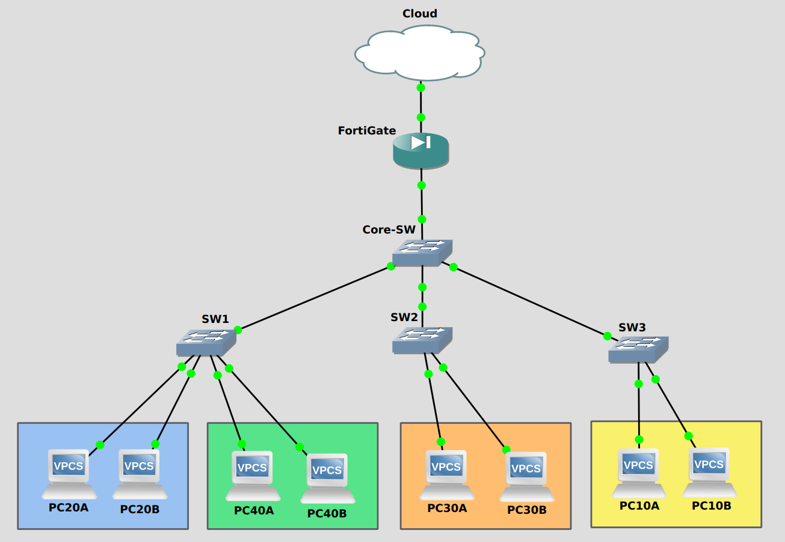

# Campus Network with VLAN Segmentation and Firewall Policy

## Overview

This project implements a **single-building campus network** in GNS3 with deliberate Layer 2 segmentation, controlled Layer 3 **inter-VLAN routing**, and a FortiGate firewall acting as the north–south security boundary.

The design prioritizes **clarity, least privilege, and operational realism** over unnecessary complexity. Each device has a clearly defined role, and security is enforced at the appropriate plane:

* **Core L3 switch** → inter-VLAN routing and east–west access control (ACLs)
* **FortiGate firewall** → north–south policy enforcement, NAT, and untrusted traffic isolation

This repository is structured so that a reviewer can understand the intent, design decisions, and verification steps **without additional explanation**.

---

## Design Constraints

To keep the lab realistic and focused, the following constraints were enforced:

* Single building campus
* One core Layer 3 switch
* Multiple Layer 2 access switches
* FortiGate as the only security boundary
* No dynamic routing protocols

These constraints prevent scope creep and mirror small-to-mid scale enterprise environments.

---

## Assumptions

* One VLAN per department
* /24 subnet per VLAN for simplicity and readability
* Core switch owns all SVIs and default gateways
* Firewall handles NAT and Internet access only
* Guest traffic must never access internal VLANs

---

## Topology



**High-level flow:**

```
[ Internet / Cloud ]
        |
   [ FortiGate ]
        |
  [ Core L3 Switch ]
   /       |       \
[Access] [Access] [Access]
```

---

## VLAN & IP Addressing Plan

### Addressing Philosophy

* One VLAN = one subnet
* Gateways use `.1` consistently
* Transit links use /30 subnets
* No overlapping or ambiguous ranges

### VLAN Table

| VLAN | Name       | Subnet        | Gateway    | Purpose          |
| ---: | ---------- | ------------- | ---------- | ---------------- |
|   10 | IT         | 10.10.10.0/24 | 10.10.10.1 | Admin / Infra    |
|   20 | Management | 10.10.20.0/24 | 10.10.20.1 | Exec / Ops       |
|   30 | HR         | 10.10.30.0/24 | 10.10.30.1 | Sensitive Data   |
|   40 | Guest      | 10.10.40.0/24 | 10.10.40.1 | Untrusted Access |

### Core ↔ Firewall Transit

| Link | Subnet         | Core IP     | Firewall IP |
| ---: | -------------- | ----------- | ----------- |
|  P2P | 10.10.255.0/30 | 10.10.255.1 | 10.10.255.2 |

---

## Layer 2 Design (Access Layer)

* Access switches operate strictly at Layer 2
* VLAN pruning is enforced on trunks
* No routing or policy logic exists on access switches

**Trunk VLAN assignments:**

| Switch | Allowed VLANs |
| -----: | ------------- |
|    SW1 | 20, 40        |
|    SW2 | 30            |
|    SW3 | 10            |

This layout ensures:

* Guest traffic never touches IT hardware
* HR systems remain isolated
* Trunks carry only what is required

---

## Core Layer 3 Responsibilities

The core switch is the routing brain of the network:

* Hosts all SVIs
* Performs inter-VLAN routing
* Enforces east–west security via inbound ACLs

### Why ACLs on SVIs?

* Wire-speed enforcement
* Simple, explicit policy control
* Prevents lateral movement before traffic ever reaches the firewall

ACLs are **stateless**, so return traffic is explicitly permitted where required. Stateful inspection is intentionally deferred to the firewall.

---

## Inter-VLAN Access Policy (East–West)

| Source \ Destination | IT | Management | HR | Internet |
| -------------------- | -- | ---------- | -- | -------- |
| IT                   | —  | ✅          | ✅  | ✅        |
| Management           | ❌  | —          | ✅  | ✅        |
| HR                   | ❌  | ❌          | —  | ✅        |
| Guest                | ❌  | ❌          | ❌  | ✅        |

Default behavior is **deny**. Only explicit business needs are permitted.

---

## Firewall Design (North–South)

### Interface Roles

* `port1` → WAN / Cloud
* `port2` → Internal (Core L3 switch)

### Firewall Responsibilities

* NAT for outbound traffic
* Internet access control
* Guest isolation
* Stateful inspection

Inter-VLAN routing is **not** performed on the firewall.

---

## Routing Plan

### Core Switch

* Default route → FortiGate

```
0.0.0.0/0 → 10.10.255.2
```

### FortiGate

* Static route back to internal networks

```
10.10.0.0/16 → 10.10.255.1
```

No dynamic routing is used.

---

## DHCP Strategy
The network utilizes a hybrid DHCP approach to balance administrative control with security isolation:

* VLANs 10/20/30 (Internal): Primarily managed via Static IP assignments for infrastructure and known endpoints to ensure auditability. Optional DHCP scopes are configured on the Core L3 Switch for temporary devices, with exclusions reserved for management interfaces
* VLAN 40 (Guest): DHCP is provided exclusively by the FortiGate Firewall. This ensures that untrusted "plug-and-play" devices are onboarded directly at the security boundary, facilitating easier logging and immediate stateful inspection.

**Design Justification:** By delegating the Guest scope to the firewall and keeping internal scopes on the core switch, we maintain a clear "separation of concerns". The Core switch focuses on high-speed internal distribution, while the FortiGate handles the overhead of dynamic, untrusted endpoint management.

---

## Verification

Verification artifacts are stored in the [/verification](./verification) directory and include:

* VLAN and trunk validation
* Inter-VLAN routing tests
* ACL enforcement proof
* Firewall policy and routing screenshots
* End-to-end connectivity checks

Every design claim in this README is backed by either a config file or a verification artifact.

---

## Repository Structure

```
.
├── README.md
├── topology.png
├── configs/
│   ├── README.md
│   ├── core-l3.txt
│   ├── core-acls.txt
│   ├── access-sw1.txt
│   ├── access-sw2.txt
│   ├── access-sw3.txt
│   └── fortigate.txt
├── verification/
│   ├── README.md
│   ├── acl-core-show-access-lists.png
│   ├── e2e-guest-to-internal-deny.png
│   ├── e2e-internal-to-internet-ping.png
│   ├── fw-policy-table.png
│   ├── fw-routing-table.png
|   ├── l2-access-sw1-show-interfaces-trunk.png
│   ├── l2-core-show-vlan-brief.png
│   └── topology.png
├── firewall-policy.md
├── lessons-learned.md
└── troubleshooting.md
```

---

## Key Takeaways

* Segmentation without policy is meaningless
* ACL order and direction matter
* NAT success does not imply end-to-end connectivity
* Firewalls are not a substitute for proper internal design

---

## Expansion Path

This design can scale without rebuild:

* Add new VLANs or departments
* Introduce additional access switches
* Extend to a second building via routed links
* Implement firewall HA

The base architecture remains intact.

