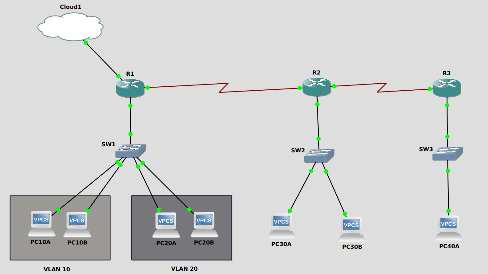

# Small Enterprise Network with VLAN Segmentation, OSPF, NAT, and ACLs

## Project Overview

This project simulates a small enterprise network designed to solve a common real-world problem: **securely connecting multiple internal departments to each other and the internet while maintaining control, scalability, and resiliency**.

The lab demonstrates **VLAN-based segmentation**, **inter-VLAN routing**, **dynamic routing with OSPF**, **edge NAT for internet access**, and **ACL-based security controls**. All configurations, verification steps, and troubleshooting notes are included to reflect realistic network engineering workflows rather than a “happy-path only” lab.

---

## Network Topology



### Logical Design Rationale

* **Three-router topology (R1–R2–R3)** simulates edge, distribution, and downstream routing roles
* **VLAN-based segmentation** isolates internal departments at Layer 2
* **Router-on-a-stick** used on R1 for inter-VLAN routing
* **OSPF (Area 0)** provides dynamic routing, resiliency, and automatic route propagation
* **NAT configured at the edge router (R1)** to simulate enterprise internet access
* **ACLs enforce least-privilege communication** between VLANs

This design mirrors a junior-level enterprise environment where segmentation, routing, and security controls coexist.

---

## IP Addressing & VLAN Plan

### VLAN Allocation

| VLAN | Purpose          | Subnet          | Gateway      |
| ---: | ---------------- | --------------- | ------------ |
|   10 | Internal VLAN 10 | 192.168.10.0/24 | 192.168.10.1 |
|   20 | Internal VLAN 20 | 192.168.20.0/24 | 192.168.20.1 |
|    — | SW2 LAN          | 192.168.30.0/24 | 192.168.30.1 |
|    — | SW3 LAN          | 192.168.40.0/24 | 192.168.40.1 |

### Device IP Plan

| Device / VLAN | Interface         | IP Address       | Subnet Mask     | Gateway / Note        |
| ------------- | ----------------- | ---------------- | --------------- | --------------------- |
| R1            | fa0/0 (NAT/Cloud) | DHCP             | —               | Default route via ISP |
| R1            | fa0/1.10          | 192.168.10.1     | 255.255.255.0   | VLAN 10 gateway       |
| R1            | fa0/1.20          | 192.168.20.1     | 255.255.255.0   | VLAN 20 gateway       |
| R1            | s0/0              | 10.0.12.1        | 255.255.255.252 | OSPF link to R2       |
| R2            | s0/0              | 10.0.12.2        | 255.255.255.252 | OSPF link to R1       |
| R2            | s0/1              | 10.0.23.1        | 255.255.255.252 | OSPF link to R3       |
| R3            | s0/0              | 10.0.23.2        | 255.255.255.252 | OSPF link to R2       |
| PC (VLAN10)   | eth0              | 192.168.10.10–11 | 255.255.255.0   | 192.168.10.1          |
| PC (VLAN20)   | eth0              | 192.168.20.10–11 | 255.255.255.0   | 192.168.20.1          |
| PC (SW2)      | eth0              | 192.168.30.10–11 | 255.255.255.0   | 192.168.30.1          |
| PC (SW3)      | eth0              | 192.168.40.10    | 255.255.255.0   | 192.168.40.1          |

---

## Key Configurations & Features

> ⚠️ Full device configurations are stored in [/configs](./configs).
. This section highlights **what** was implemented and **why**.

### VLAN Segmentation & Trunking

* VLANs created on SW1 for internal segmentation
* Access ports assigned per VLAN
* 802.1Q trunk configured between SW1 and R1

### Inter-VLAN Routing (Router-on-a-Stick)

* R1 uses subinterfaces (`fa0/1.10`, `fa0/1.20`) mapped to VLANs
* Physical interface carries tagged traffic only (no IP assigned)
* Enables centralized Layer 3 control while keeping switches Layer 2

### Dynamic Routing (OSPF)

* OSPF configured between R1, R2, and R3
* Single-area design (Area 0) for simplicity
* Advertises VLAN subnets and inter-router links
* Chosen over static routes to allow **automatic reconvergence and scalability**

### NAT (Edge Internet Access)

* NAT overload configured on R1 only
* Inside interfaces: VLAN subinterfaces and internal serial link
* Outside interface: NAT/Cloud-facing interface (DHCP)
* Allows all internal networks to share a single public IP

### Security: Inter-VLAN ACL Policy

* VLAN 20 is **blocked from initiating traffic** to VLAN 10
* VLAN 10 is permitted to access all internal and external networks
* Return traffic explicitly permitted to avoid asymmetric routing issues
* ACL applied inbound on VLAN 20 subinterface

---

## Validation & Testing

### Connectivity Test Results

| Test Case       | Source  | Destination | Result    |
| --------------- | ------- | ----------- | --------- |
| Inter-VLAN Ping | VLAN 10 | VLAN 20     | ✅ Success |
| Inter-VLAN Ping | VLAN 20 | VLAN 10     | ❌ Blocked |
| Internet Access | VLAN 10 | 8.8.8.8     | ✅ Success |
| Internet Access | VLAN 20 | 8.8.8.8     | ✅ Success |

Verification outputs are stored in [/verification](./verification).

---

## Traffic Flow Walkthrough

**Packet Flow: VLAN 10 PC → Internet**

1. PC sends packet to default gateway (192.168.10.1)
2. R1 routes traffic via VLAN 10 subinterface
3. Packet matches NAT ACL and is translated
4. Traffic exits R1 via NAT-facing interface
5. Return traffic is de-NATed and forwarded back to VLAN 10

This illustrates inside vs outside NAT behavior and correct edge placement.

---

## Troubleshooting Highlights

Realistic failures were encountered and resolved, including:

* Trunk encapsulation mismatches (`dot1Q` not set)
* Subinterfaces remaining down due to parent interface shutdown
* Duplicate IP addressing on serial links
* Asymmetric ACL behavior blocking ICMP return traffic
* NAT node limitations requiring Cloud replacement

A full troubleshooting log is available in [troubleshooting.md](./troubleshooting.md).

---

## Future Improvements

* Add HSRP between R1 and R2 for gateway redundancy
* Introduce a DMZ VLAN with port forwarding
* Move inter-VLAN routing to a Layer 3 switch
* Add EtherChannel between routers for redundancy
* Perform intentional link failures to document OSPF reconvergence

---

## Repository Structure

```text
Small_Enterprise_VLAN_OSPF_NAT_ACL/
|
├── configs/
│   ├── R1-startup-config.txt
│   ├── R2-startup-config.txt
│   ├── R3-startup-config.txt
│   ├── SW1-startup-config.txt
│   ├── SW2-startup-config.txt
│   └── SW3-startup-config.txt
|
├── verification/
|   ├── topology.png
|   ├── ospf-neighbors.png
|   ├── routing-table.png
|   ├── nat-translations.png
|   ├── acl-block-vlan20-to-vlan10.png
|   └── successful-connectivity.png
|
├── troubleshooting.md
|
├── lessons-learned.md
|
└── README.md
```

---

## Engineering Takeaways

* VLAN issues are rarely just Layer 2 problems
* ACL order matters, especially for return traffic
* NAT must live at the edge — nowhere else makes sense
* OSPF wildcard masks require a different way of thinking
* Systematic troubleshooting beats random command execution

> 📘 A deeper breakdown of mistakes, misconceptions, and design corrections  
> is documented in [lessons-learned.md](./lessons-learned.md).
